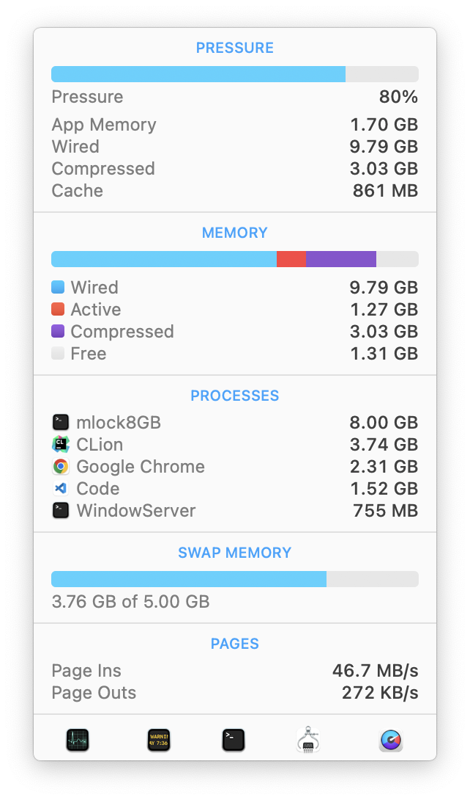

# mlock8GB

You're using 16gb macbook. Now you want to test if you can cope with 8gb one.

Use this.

This app acquires 8gb of wired (non-paged, non-compressible) memory (non-usable memory). It sits there, and macOS will
have to cope with the rest of the memory.

AHA!